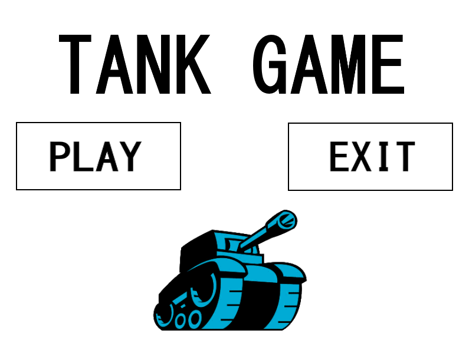
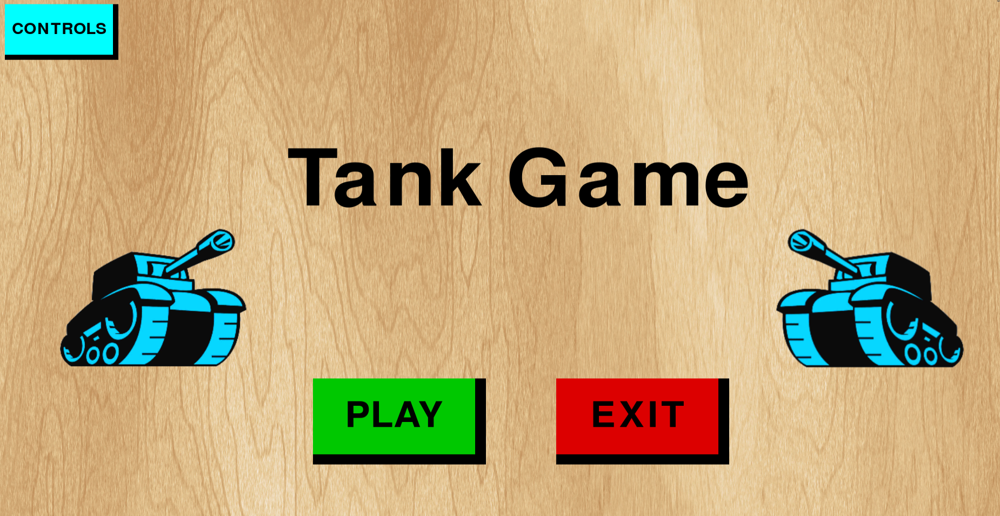
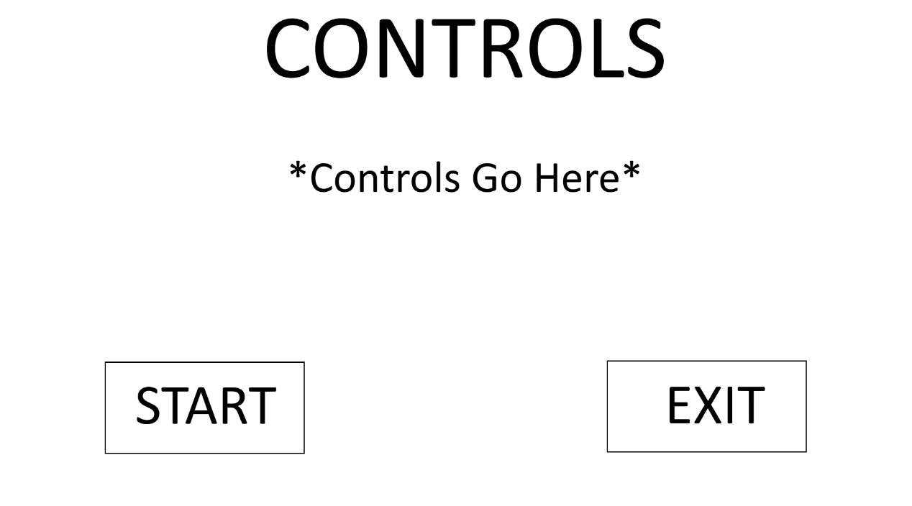
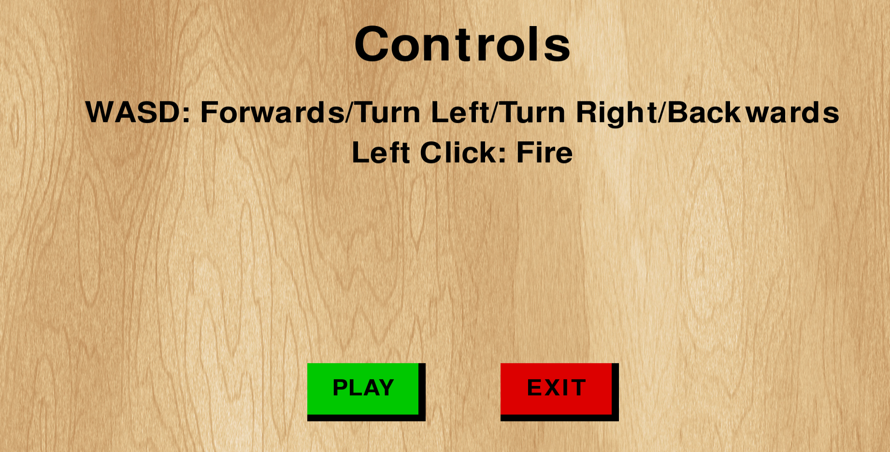
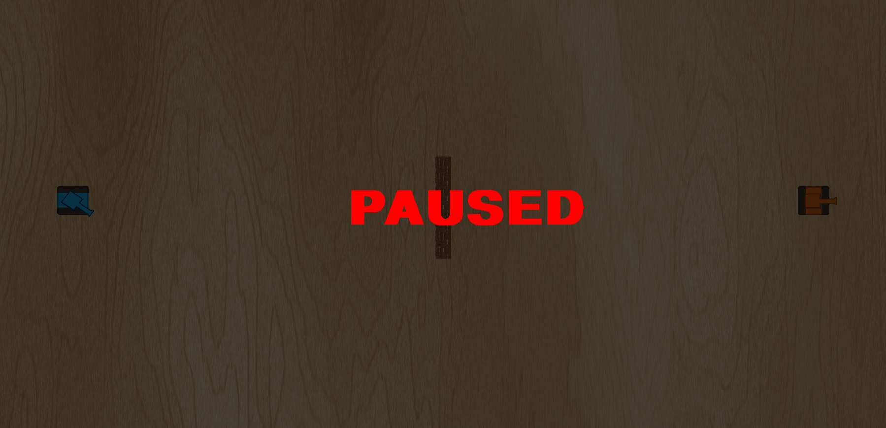
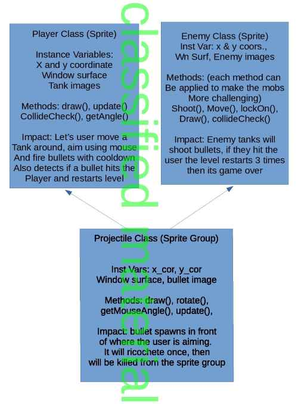

# Tank Game
## CS 110 Final Project
### Fall 2019
### [Assignment Description](https://drive.google.com/open?id=1HLIk-539N9KiAAG1224NWpFyEl4RsPVBwtBZ9KbjicE)

[GitHub Repository](https://github.com/bucs110/final-project-fall19-the_tankerz.git)

[Presentation](https://docs.google.com/presentation/d/1cIXv0D-JrLnxFqiXt-OvEsKarb0Meo6kkbh6DsJHvGs/edit?usp=sharing)

### Team: the_tankerz
#### Armaan Gill, Kevin Dougherty, Thomas Fasano

***

## Project Description
The objective of our project is to create a basic tank game, heavily influenced by the popular game Wii Tanks! In the game, the player takes control of a blue tank within a small rectangular arena inhabited by enemy tanks. The objective of the game is to complete 'missions' which involve the player defeating all enemy tanks in the arena without themselves being damaged, thus advancing to the next mission.

***    

## User Interface Design
* __Main Menu__
        
        
        This Main Menu screen contains a controls button, an exit button, and a start button. These buttons send the player to a separate controls screen, leave the program and start the game respectively.
* __Control Screen__
        
        
        The Controls screen displays the controls in the game and allows the player to start and exit the game using buttons.
* __Pause Screen__
        
        By hitting 'p' the player can pause all sprites on the screen and brings up a translucent black screen with 'paused' written over it in red text. Hitting 'p' again will remove the screen and resume the game.
***        

## Program Design

* Non-Standard libraries
    * **Pygame** _(https://www.pygame.org/docs/)_
        Pygame is a Free and Open Source python programming language library for making multimedia applications like games built on top of the SDL library.
* Classes
    * __Player__ - A class that defines the player's tank. It defines the size and placement of the tank, as well as how movement works for the tank. Contains information necessary for the collision feature to function.
    * __Enemy__ - A class that defines the enemy tanks. Similarly to the Player class, it defines the size and placement of the enemy tanks. It also defines the enemy's actions.
    * __Projectile__ - A class that generates the projectiles that are fired by both the player and enemy tanks. This class has a major impact on the collision mechanic in this game, with both tanks and walls. 
    * __Cannon__ - A class that defines the function of the player's turret. It determines how the  turret responds as a result of mouse input. Contains information necessary for the collision feature to function.
    * __Turret__ - A class containing methods used for turret functionality.
    * __Wall__ - A class that defines the function of a wall in the game. This class determines how walls will interact with other objects and sprites in the game.
    * __Controller__ - A class that defines the “rules” and logic of the interlocking relationships between the other classes and UI. It establishes the data permanence of player lives and number of enemies, the sound effects and musical playback, and opens the actual game window itself. It also interprets each map, provided as a txt file, and combines it with the artwork to create and display each level. All the menus, collision functions, key bindings, and refresh rate are established here as well. It calls upon each of the prior classes and their UI elements to display the game as what is visualized by the player.   
***

## Tasks and Responsibilities

### Software Lead - Armaan Gill

Worked as integration specialist by helping organize the code into the proper MVC format, which allowed all portions of the code to be run from a single file. He worked closely with the front and back end specialists to ensure both aspects of the game were implemented well, and ensure quality of the code. He also helped in the prioritization of certain features in the game, helping to determine the amount of attention recieved by each aspect of the game, in order to get the project completed.

### Front End Specialist - Kevin Dougherty

The front end specialist conducted significant research on how to create visual aspects such as buttons and on-screen text using pygame. He used this knowledge to design and program a UI consisting of a main menu, control screen, pause menu, and mission banner. He also collaborated with the Back End specialist to add music and sound effects to all different parts of the game.

### Back End Specialist - Thomas Fasano

The back end specialist wrote the major classes that would be used in the game,  as well as implementing major pygame functionality into them. He also made headway into major game mechanics such as player movement, projectile aiming and firing, and collisions. He also introduced some advanced functionality such as aim tracking for enemies as well as the very modular map design, which allows for the addition of new levels easily.

## Testing
* We will go step-by-step through our ATP, which will test every aspect of our game, and ensure that every feature we implemented into the game works as expected. The ATP was updated throughout the development of our project to document the various features of our game, and ensure we had a clear and concise way of expressing and testing them. 

* __Our ATP__

| Step                  | Procedure     | Expected Results  | Actual Results | Pass? |
|-----------------------|:-------------:|:------------------| -------------- | ----- |
|  1  | Run main.py | Main menu opens normally and is functional. When you hover over the buttons, they will trigger the "hover" color to display for each button. The menu music begins playback.|  |  |
|  2  | Click "Controls" button | Menu should change to a screen that instructs the player how to move the tank and fire. Hovering over buttons will trigger "hover" color. |        |        |
|  3  |  Click "Play" button. |  Will start game. A banner will display conveying the level number, number of lives, and number of enemy tanks. During this time the trumpet sound effects should play. After 5 seconds, the banner will disappear and the level will be displayed. Level music should begin playback. Spawns blue tank, controlled by player, as well as orange "enemy" tanks.  |     |      |
|  4  |  Use WSAD keys to move, aim with mouse, left-click to fire. | A and D should rotate tank left and right, respectively. W and S should move tank forwards and backwards, respectively. Moving the mouse should change the "aim" of the tank. Left-clicking should fire a projectile that will bounce off one wall, and disappear on second collision. |  |  |
|  5  | Use the controls to move the tank into a "wall" | Upon contact, the tank should stop and not pass through the wall | | |
|  5  | Aim at an enemy tank and fire | Upon contact, both the bullet and enemy should disappear. |  |  |
|  6  | Aim directly forward (no angle) at a wall and fire | When the bullet hits the wall it should bounce directly back and hit player's tank. Upon contact, the player's tank should delete. If player has >1 life remaining after being destroyed, it should respawn on the same level.  | | |
|  7  | Defeat all enemies for level 1 | The game should then begin level 2, again displaying the same banner as before, with the data updated. | | |
|  8  | Begin to move towards the enemy tanks. | The enemy tank cannons should track the player's tank. The enemy tanks should begin firing when the player comes within a certain range of them |||
